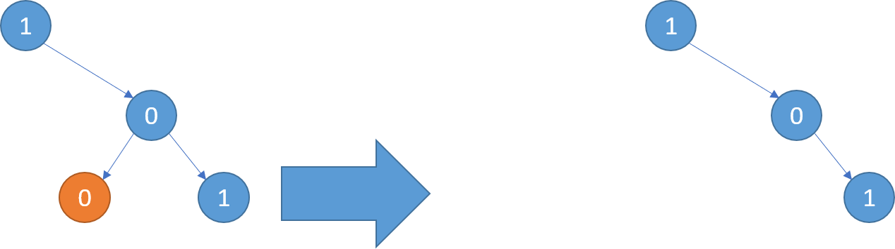
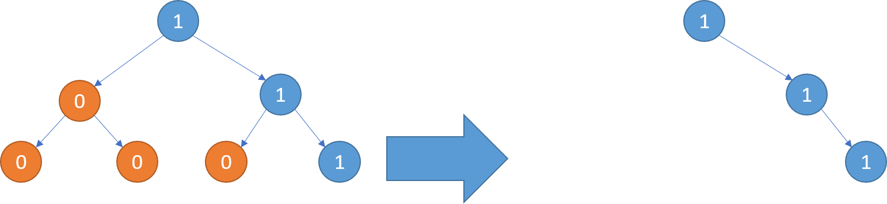

## 
给定二叉树根结点 root ，此外树的每个结点的值要么是 0，要么是 1。

返回移除了所有不包含 1 的子树的原二叉树。

( 节点 X 的子树为 X 本身，以及所有 X 的后代。)

示例1:
输入: [1,null,0,0,1]
输出: [1,null,0,null,1]
 
解释: 
只有红色节点满足条件“所有不包含 1 的子树”。
右图为返回的答案。

示例2:
输入: [1,0,1,0,0,0,1]
输出: [1,null,1,null,1]

示例3:
输入: [1,1,0,1,1,0,1,0]
输出: [1,1,0,1,1,null,1]

说明:

给定的二叉树最多有 100 个节点。
每个节点的值只会为 0 或 1 。

来源：力扣（LeetCode）
链接：https://leetcode-cn.com/problems/binary-tree-pruning
著作权归领扣网络所有。商业转载请联系官方授权，非商业转载请注明出处。

## 思路
首先我们要明确什么样的节点需要删除
删除的节点是 子节点全是 0 的子树
删除子树是很难得，因为我们首先要确定这颗子树的节点全是 0，那么我们就只能遍历到底才能够判断出这颗子树是不是该删除。
那么我们可以删除0节点且是不存在左右子树的结点。
这样我们只需要将其赋值为 null
然后我们一直进行该项操作就能将全是0的子树个删除了。
## 测试
[1,null,0,0,1]
[1,1,1,0,0,null,1,1,null,null,null,null,0]
[]
[0]
[0,1,0,1,null,null,0,0,null,null,0]
[1,1,1,null,1,1,1,1,1,null,null,1,1,null,null,null,0,null,0,null,0,null,null,null,0]
[1,1,0,1,1,0,1,0]
[1,0,1,0,0,0,1]